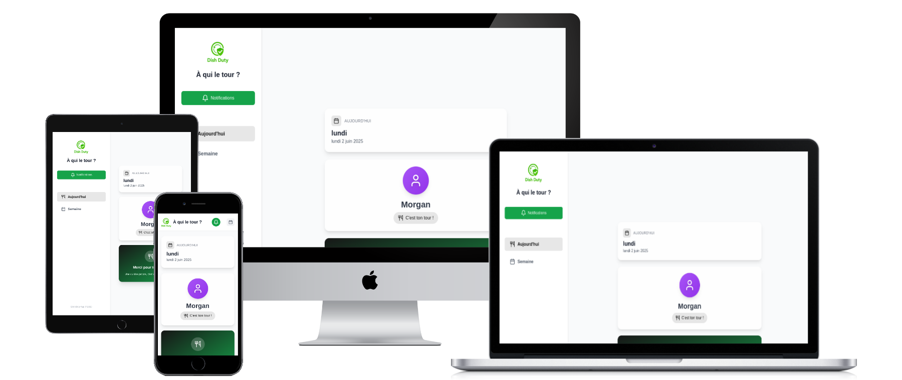
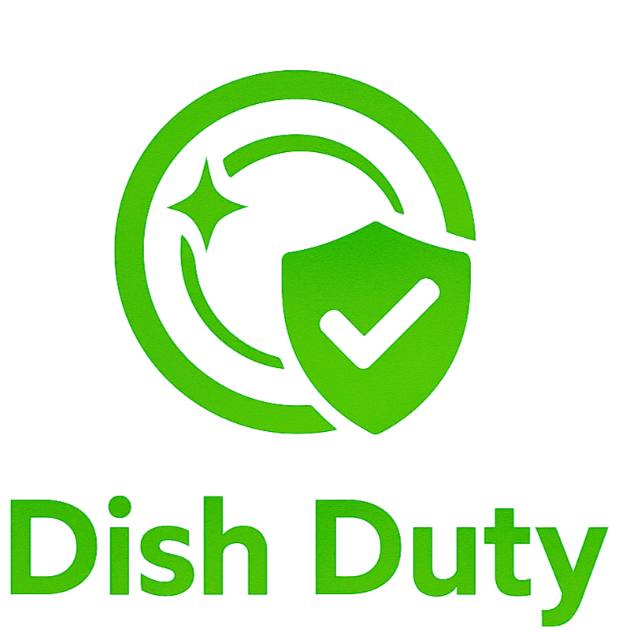
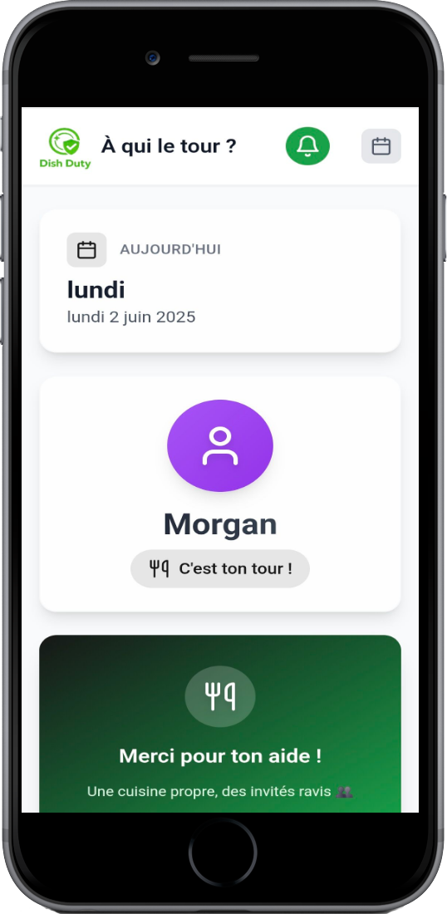
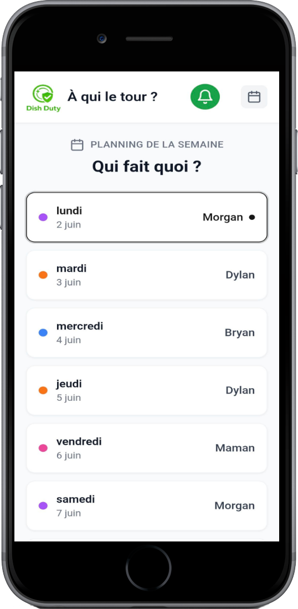
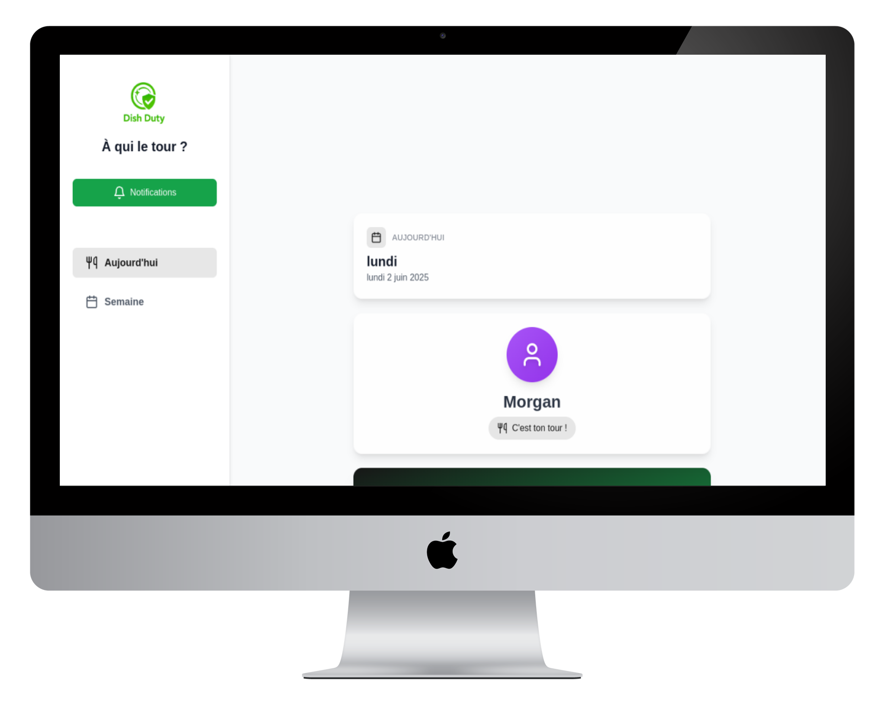
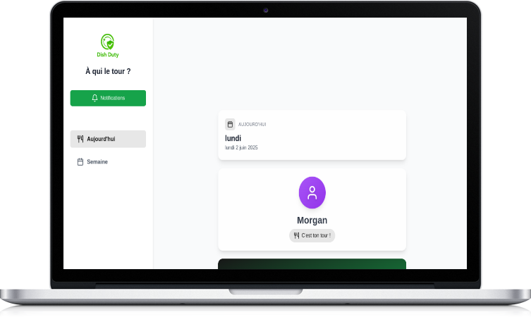
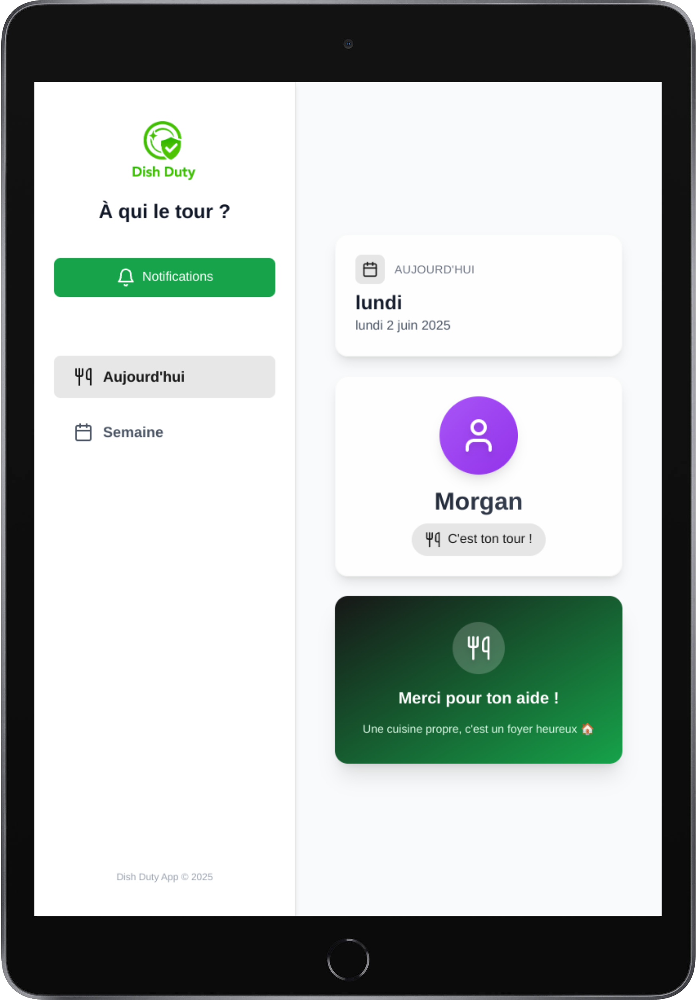

<p align="center">
  
</p>

<h1 align="center">🍽️ Dish Duty</h1>
<p align="center">
  
</p>
<p align="center">
  <b>L'application familiale ultime pour ne plus jamais se disputer la vaisselle !</b><br>
  <a href="https://dishduty.one" target="_blank">Voir le site en ligne 🚀</a>
</p>

---

## ✨ Présentation

**Dish Duty** est une application web moderne, responsive et ultra fluide, pensée pour organiser la corvée de vaisselle dans la bonne humeur.  
Notifications push, planning intelligent, design mobile & desktop, tout y est pour une expérience utilisateur au top !

---

## 🖥️ Aperçu multi-supports

<p align="center">
  
</p>

---

## 📱 Vue quotidienne

<p align="center">
  
</p>

- Affichage du responsable du jour
- Message motivant aléatoire
- Design coloré et dynamique

---

## 📅 Vue hebdomadaire

<p align="center">
  
</p>

- Planning de la semaine
- Attribution claire pour chaque jour
- Légende colorée pour chaque membre

---

## 🚀 Fonctionnalités principales

- **Notifications push** (Web Push API)
- **Responsive** : mobile, tablette, desktop
- **Planning automatique** (rotation personnalisable)
- **Design moderne** (animations, skeletons de chargement)
- **Mode admin** pour gérer les abonnements
- **Expérience utilisateur premium** (transitions, feedbacks, accessibilité)

---

## 🛠️ Stack technique

- **Next.js 15**
- **TypeScript**
- **Tailwind CSS**
- **Framer Motion** (animations)
- **MongoDB** (stockage des abonnements)
- **Web Push** (notifications)
- **React Hot Toast** (feedback utilisateur)
- **Radix UI** (composants accessibles)

---

## 📸 Galerie de screenshots

<p align="center">
  
  
  
</p>

---

## 🔔 Notifications Push

- Système d'abonnement simple (1 clic)
- Notifications automatiques pour rappeler la corvée
- Gestion des abonnements en base MongoDB

---

## 🧑‍💻 Installation & développement

```bash
git clone https://github.com/ton-utilisateur/dish-duty-app.git
cd dish-duty-app

# Installe les dépendances
(p)npm install

# Copie le .env.example et configure tes clés
cp .env.example .env.local

# Génère les clés VAPID pour les notifications push
npx web-push generate-vapid-keys

# Lance le serveur de dev
(p)npm run dev
```

---

## ⚙️ Configuration

**Variables d'environnement principales :**

- `MONGO_URI` : URL de connexion MongoDB
- `NEXT_PUBLIC_VAPID_PUBLIC_KEY` : Clé publique VAPID (Web Push)
- `VAPID_PRIVATE_KEY` : Clé privée VAPID
- `ADMIN_PASSWORD` : Mot de passe admin pour la gestion des abonnements

---

## 🏗️ Structure du projet

```
/app
  page.tsx                # Page principale (point d'entrée)
  layout.tsx              # Layout global de l'app
  /api/                   # Endpoints API (push, admin, etc.)
  /admin/                 # Pages et outils d'administration

/components
  DesktopLayout.tsx       # Layout desktop
  MobileLayout.tsx        # Layout mobile
  daily-view.tsx          # Vue quotidienne
  weekly-view.tsx         # Vue hebdomadaire
  PushNotifications.tsx   # Gestion des notifications push
  theme-provider.tsx      # Gestion du thème (dark/light)
  /ui/                    # Composants UI réutilisables (skeleton, button, etc.)

/hooks
  use-mobile.tsx          # Hook pour détecter le mobile
  use-toast.ts            # Hook pour les toasts/notifications

/lib
  utils.ts                # Fonctions utilitaires (planning, formatage, etc.)
  notifications.ts        # Logique notifications push
  /models/                # Modèles Mongoose (MongoDB)

/public
  /screenshot/            # Screenshots pour la doc et le marketing
    all-devices.png
    daily-view.png
    weekly-view.png
    ...
  dish-duty-logo.png      # Logo principal de l'app
  sw.js                   # Service Worker pour les notifications push
  favicon.ico             # Favicon
  site.webmanifest        # Manifest PWA
```

---

## 👨‍👩‍👧‍👦 Pour qui ?

- Familles, colocations, couples, amis…
- Toute personne qui veut une répartition équitable et fun des tâches !

---

## 💡 Personnalisation

- Modifie le planning dans `lib/utils.ts` pour adapter les prénoms et la rotation.
- Change les phrases motivantes dans `components/daily-view.tsx`.
- Ajoute tes propres couleurs ou avatars dans le code.

---

## 🛡️ Sécurité & RGPD

- Les abonnements push sont anonymes et stockés en base.
- Pas de tracking, pas de pub, juste la vaisselle !

---

## 📬 Contact & support

- [Ouvre une issue sur GitHub](https://github.com/Morg9864/dish-duty-app/issues)
- Contacte-moi sur [morgan.phemba@gmail.com](mailto:morgan.phemba@gmail.com)

---

<p align="center">
  
  <br>
  <b>Dish Duty</b> — La vaisselle, sans prise de tête !
</p> 